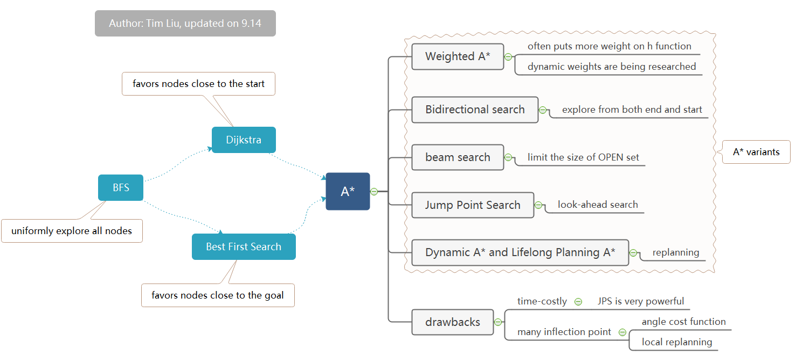

# AStarAndFriends
## Introduction
This is an ongoing repo, containing a sequence of search-based path planning algorithms. It will implement several path planning algorithms and visualize them in a logical order. Detailed comments and explanation are expected as they indicate my learning and interpretation. Hopefully, this might be helpful for you too.
## Search-based path planning
### Overview of the path planning algorithm
Generally, the family of search-based planning algorithms can be classified as classical path planning algorithms, while the intelligent branch contains genetic algorithms, PSO, ACO, and so on. While the search-based methods explore the space gradually, another branch of classical methods, the sampling-based methods take random samples and construct the path. A basic and classical example of these algorithms is the rapidly-exploring random tree (RRT).

### Internal connections between search-based method

One good start is the breadth-first search, as it contains the essence of search-based planning algorithms. The thoughts of maintaining 2 sets of frontiers and history nodes are fundamental and are widely applied in various cases of more advanced algorithms.
The breadth-first search **uniformly** explores all adjacent nodes. Consequently, this introduces a large computation cost.  
Dijkstra's algorithm and best-first search both consider the **priority** of the nodes. Dijkstra favors nodes nearer to the start, while Best First Search favors the ones nearer to the goal.  
In a unified grid space, where all vacant nodes have the same cost to pass, the Dijkstra performs similarly to the best-first search. But when grids have different properties (like a game's map), we can see that Dijkstra's algorithm avoids the nodes with a high cost to pass through.  
The Best-first search algorithm evaluates the node's distance to the goal. This algorithm could be very **fast** potentially, especially in an open environment, in which its searching progress basically expands around the line between the start and the goal. However, it is **not** promised to find the optimal path. When meeting a dead end or a concave obstacle, it probably would go all the way until hitting the obstacle and construct a path leading to the obstacle.  

A* is the combination of both Dijkstra's algorithm and the best-first search. Because it combines the distance to **both the start and the goal** in the priority queue. These two distance factors are fundamental for the search-based algorithm, and thus, a lot of algorithms are derived from A*.
